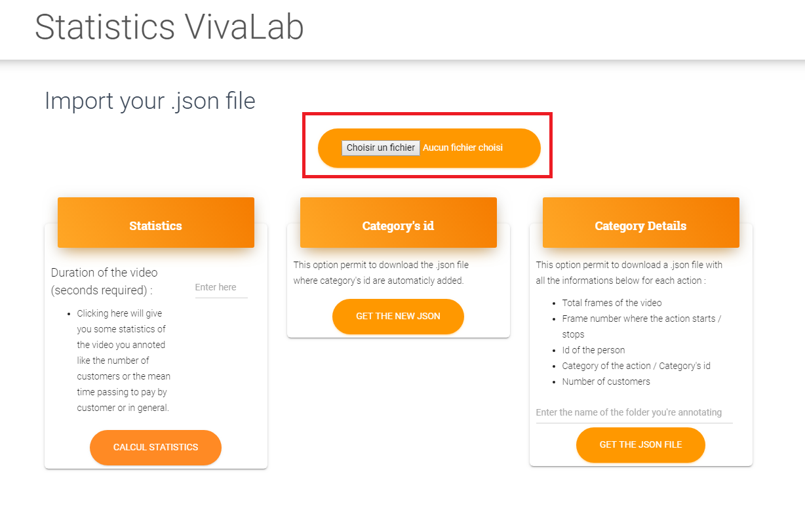

# VivaStatistics

## Required

You just need an annotaion file that needs to have the category Id added. (categories : `paying`, `receiving`, `picking_up` and `ordering`).

## How does it work ?

First of all import you annotation file.

### Get the statistics of the video

If you want to see the statistics like the number of customers or the mean time passing to pay by customer or in general, you must enter the time of the video in the field and click on the button below. The statistics will appear bellow. 

## Licensing

- Copyright 2018 Creative Tim (https://www.creative-tim.com/?ref=mk-github-readme)

- Licensed under MIT (https://github.com/creativetimofficial/material-kit/blob/master/LICENSE.md)
