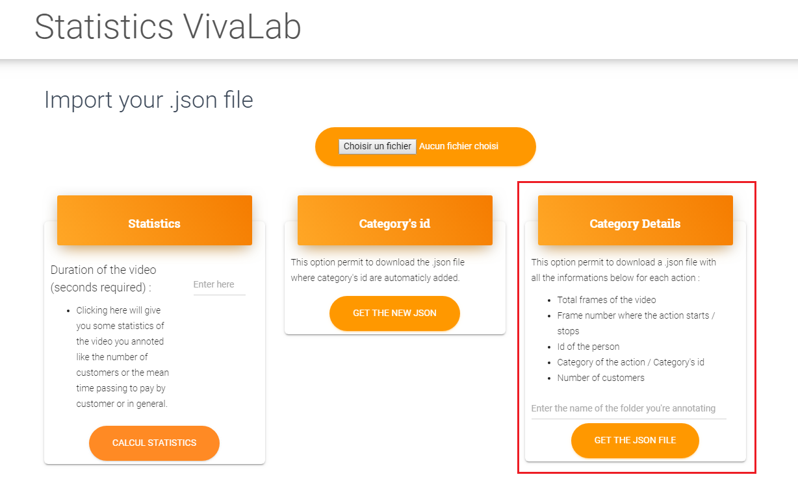

# VivaStatistics

## Required

You just need an annotaion file that needs to have the category Id added. (categories : `paying`, `receiving`, `picking_up` and `ordering`).

## How does it work ?

First of all import you annotation file.

### Get the statistics of the video

If you want to see the statistics like the number of customers or the mean time passing to pay by customer or in general, you must enter the time of the video in the field and click on the button below. 

The statistics will appear bellow. 

### Download the Json file with the category id added

Refer to the card in the center to download your .json file where category's id are automaticly added.

### Dowload the details of the action

Refer to the right card to dowload  a .json file with all the informations below for each action : 

- Total frames of the video
- Frame number where the action starts / stops
- Id of the person
- Category of the action / Category's id
- Number of customers

**Warning**: This json file will be useful for the plotcorrelation app at https://github.com/cladr068/PlotCorrelationFrom3DDetection

## Licensing

- Copyright 2018 Creative Tim (https://www.creative-tim.com/?ref=mk-github-readme)

- Licensed under MIT (https://github.com/creativetimofficial/material-kit/blob/master/LICENSE.md)
